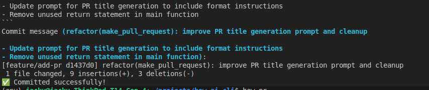

# Ask How CLI

Update your Git workflow with AI

## Installation 

Requires:
- Python3.4+
- Ollama

Step 1 - clone this repo
```bash
git clone https://github.com/j2nullify/ai-git-commit.git
cd ai-git-commit
pip install .
```

## Using Ask AI CLI

To generate automated commit messages: 
```
# Add your files like normal
git add -u
# Ai-generate commit messages
how-commit
```



Then, you can push your changes and use AI to auto-generate you a description

```
how-pr
```

See example PR: https://github.com/j2nullify/ai-git-commit/pull/2

